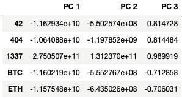
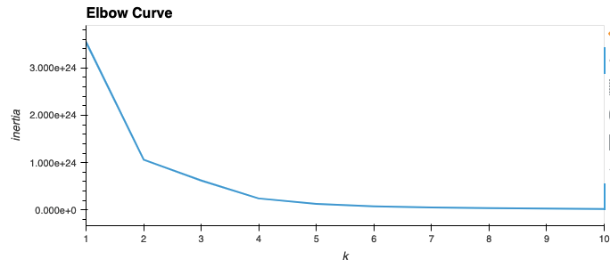
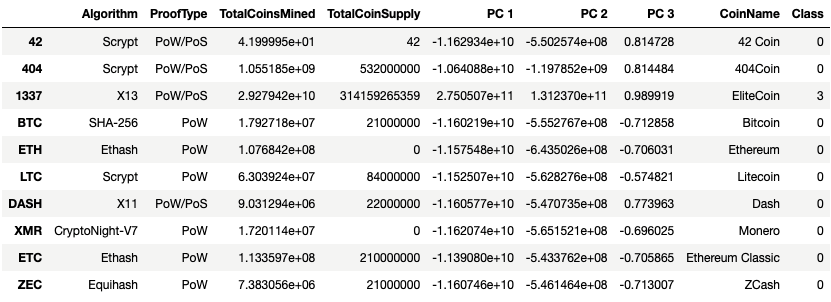
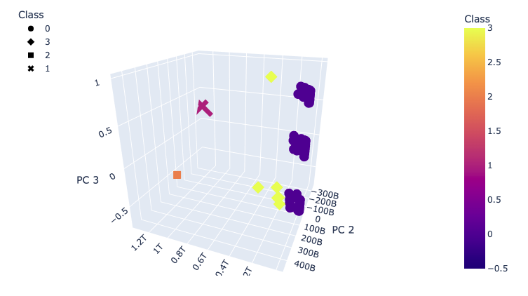
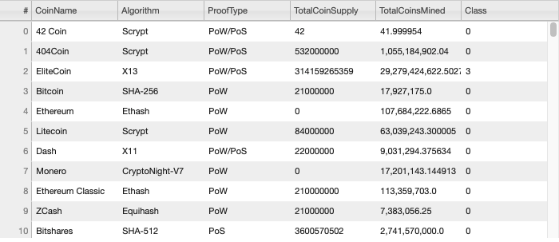
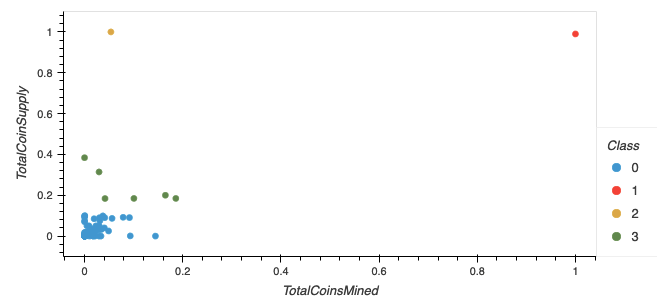

# Cryptocurrencies

## Overview
### Purpose
I have been asked to create a report that includes what cryptocurrencies are on the trading market and how they could be grouped to create a classification system for this new investment. Below is are the steps I took to cluster these crypotcurrencies together.

## Methodology
### Preprocessing Data
In order to get the cryptocurrency data ready for analysis, several transformations took place. The dataframe was filtered to include only cryptocurrencies that were actively traded and mined along with ones that had a working algorithm. Text features were assigned to dummy variables and the entire dataframe was standardized. Standardizing converts all data to a common format to enable users to process and analyze it.

### PCA
After preparing the data for analysis, the dimensions were reduced to three principal components. This process effectively shrinks the dataframe from many columns into three to speed up the machine learning process. Only a very small portion of data (<1%) is lost in this process.  

### K-Means Algorithm
Next, I created an elbow curve to determine the optimal amount of clusters to fit this data. I found k to equal 4.

  

Using 4 clusters, I initialized the K-means algorithm to fit and predict the clusters from the data. Each crytpocurrency is assined to a class and the classification was added to the dataframe.

### Visualizing Crytpocurrency Results
I first created a 3D scatter plot with the PCA data and thhe clusters.

  

Then, I created a table with all tradeable cryptocurrencies and found there to be 532 that were tradeable. 

  

Lastly, I created a 2D scatter plot using the total amount of coins mined as the x-axis and the total coin supply as the y-axis. As seen below, there are four clusters. Two of the clusters stand out as only having one cryptocurrency in each cluster.

  

## Tools Used:
- Python
    - sklearn Library